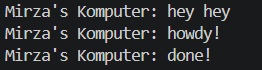
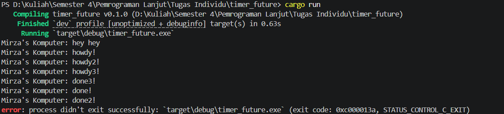
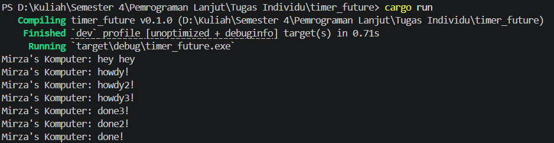
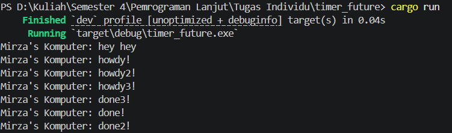

## Experiment 1.2: Understanding how it works

Pada eksperimen ini, saya menambahkan baris berikut setelah `spawner.spawn(...)`:

```rust
println!("Mirza's Komputer: hey hey");
```

Hasil Eksekusi

Output program:



Penjelasan

Output `Mirza's Komputer: hey hey` muncul terlebih dahulu karena baris tersebut berada di luar asynchronous task. Baris tersebut langsung dieksekusi oleh fungsi main sebelum `executor.run()` dipanggil.

Sementara itu, kode di dalam `spawner.spawn(...)` tidak langsung dijalankan ketika spawn dipanggil. Fungsi spawn hanya memasukkan task ke dalam antrean task. Task tersebut baru mulai dijalankan ketika `executor.run()` dipanggil.

Setelah executor mulai berjalan, task asynchronous akan dipoll. Karena itu, output `Mirza's Komputer: howdy!` muncul setelah hey hey.

Kemudian program menunggu TimerFuture selama dua detik. Setelah timer selesai, task dibangunkan kembali dan executor melanjutkan eksekusi task tersebut. Oleh karena itu, output `Mirza's Komputer: done!` muncul terakhir.

## Experiment 1.3: Multiple Spawn and removing drop

Pada eksperimen ini, saya mencoba menjalankan lebih dari satu task menggunakan `spawner.spawn(...)`. Saya membuat tiga asynchronous task yang masing-masing mencetak pesan `howdy`, menunggu `TimerFuture`, lalu mencetak pesan `done`.

Kode yang digunakan:

```rust
spawner.spawn(async {
    println!("Mirza's Komputer: howdy!");
    TimerFuture::new(Duration::new(2, 0)).await;
    println!("Mirza's Komputer: done!");
});

spawner.spawn(async {
    println!("Mirza's Komputer: howdy2!");
    TimerFuture::new(Duration::new(2, 0)).await;
    println!("Mirza's Komputer: done2!");
});

spawner.spawn(async {
    println!("Mirza's Komputer: howdy3!");
    TimerFuture::new(Duration::new(2, 0)).await;
    println!("Mirza's Komputer: done3!");
});

println!("Mirza's Komputer: hey hey");

// drop(spawner);

executor.run();
```

Output 1: drop(spawner) dihapus

Hasil eksekusi:



Ketika drop(spawner) dihapus, program tidak berhenti secara otomatis walaupun semua task sudah selesai. Hal ini terjadi karena spawner masih hidup, sehingga channel pengirim task juga masih dianggap aktif.

Pada fungsi executor.run(), executor terus menunggu task baru dari ready_queue.recv(). Karena channel belum ditutup, executor menganggap masih ada kemungkinan task baru dikirim. Akibatnya program terus berjalan dan harus dihentikan secara manual menggunakan Ctrl + C.

Kode STATUS_CONTROL_C_EXIT muncul karena program dihentikan secara paksa dari terminal.

Output 2: drop(spawner) digunakan

Hasil eksekusi:



Ketika drop(spawner) digunakan, program dapat berhenti dengan normal. Hal ini karena setelah semua task dimasukkan ke antrean, spawner dihapus sehingga tidak ada lagi pengirim task baru.

Executor tetap menjalankan task-task yang sudah ada sampai selesai. Setelah semua task selesai dan channel sudah tertutup, ready_queue.recv() akan gagal, lalu loop pada executor.run() berhenti.

Output 3: drop(spawner) digunakan lagi

Hasil eksekusi:



Pada percobaan ini, urutan output bagian done berbeda dari output sebelumnya. Hal ini dapat terjadi karena setiap task menggunakan TimerFuture yang berjalan secara asynchronous.

Ketiga task memiliki durasi timer yang sama, yaitu dua detik. Namun, saat timer selesai, urutan task yang dibangunkan dan dimasukkan kembali ke antrean executor tidak selalu sama. Oleh karena itu, urutan done!, done2!, dan done3! bisa berubah-ubah di setiap eksekusi.

Kesimpulan

Pemanggilan spawner.spawn(...) hanya memasukkan task ke dalam antrean, bukan langsung menjalankan task sampai selesai. Task baru benar-benar dijalankan ketika executor.run() dipanggil.

Baris println!("Mirza's Komputer: hey hey"); muncul pertama karena berada di luar asynchronous task dan dieksekusi langsung oleh fungsi main.

Penggunaan drop(spawner) penting agar executor mengetahui bahwa tidak akan ada task baru lagi. Tanpa drop(spawner), executor akan terus menunggu task baru dan program tidak akan berhenti secara otomatis.

Pada multiple spawn, urutan awal howdy, howdy2, dan howdy3 cenderung mengikuti urutan task dimasukkan ke antrean. Namun, urutan output done, done2, dan done3 dapat berbeda-beda karena task menunggu timer secara asynchronous dan dibangunkan kembali oleh thread timer.
